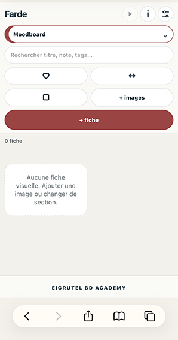
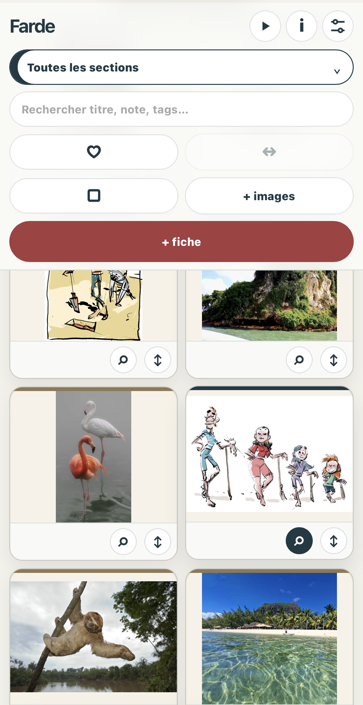
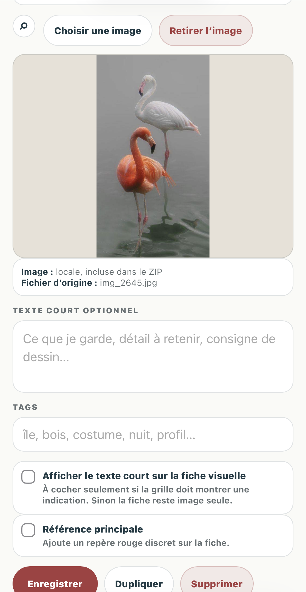
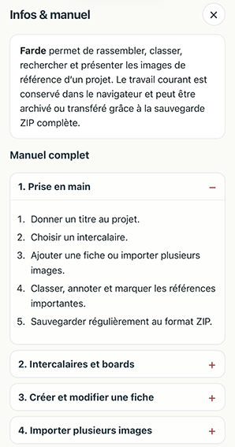
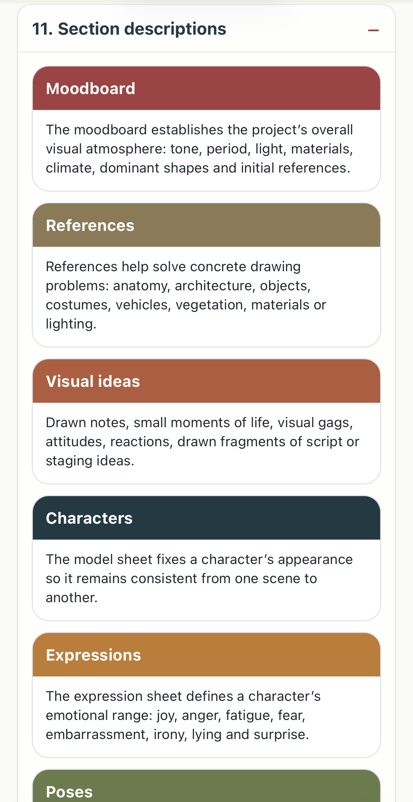
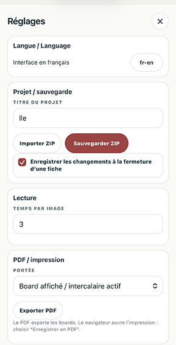
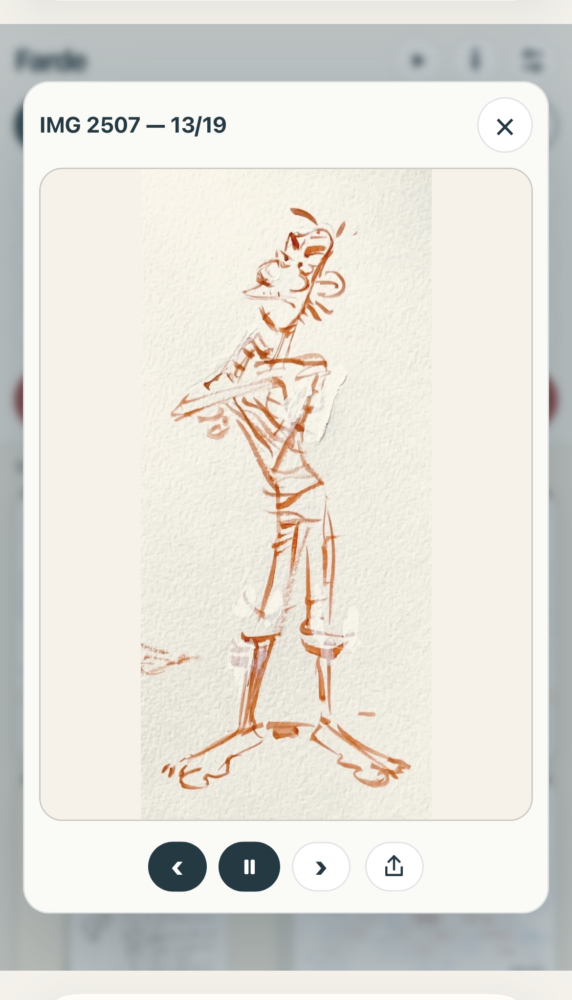
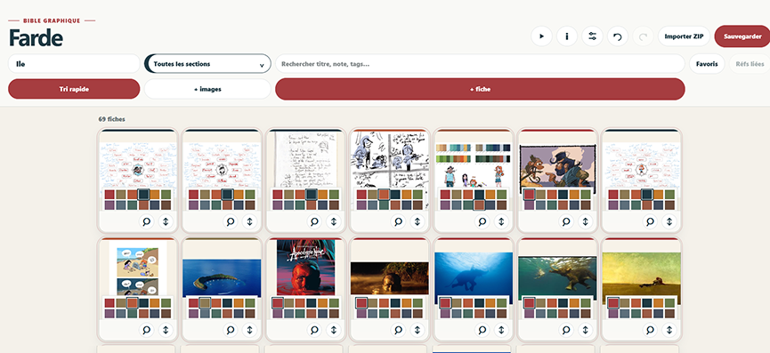
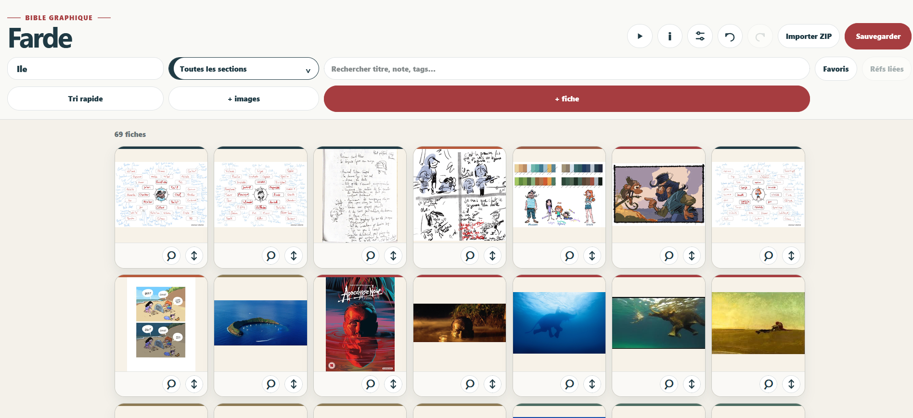

# Farde

**Bible graphique bilingue pour organiser les références visuelles d’un projet.**

Farde est une application web autonome développée dans le cadre d’**Eigrutel Lab**, l’atelier d’outils libres pour la bande dessinée d’**Eigrutel BD Academy**.

Elle permet de réunir dans un même classeur visuel les références, personnages, expressions, poses, costumes, objets, décors, palettes, indications de style, éléments de continuité et idées visuelles d’un projet.

## Aperçu
<table>
  <tr>
    <td></td>
    <td></td>
    <td></td>
        <td></td>
  </tr>
  <tr>
    <td align="center">Accueil</td>
    <td align="center">Intercalaire toutes sections</td>
    <td align="center">Fiche</td>
        <td align="center">Infos</td>
  </tr>
</table>
<table>
  <tr>
    <td></td>
    <td></td>
    <td></td>
    <td></td>
  </tr>
  <tr>
    <td align="center">Infos</td>
    <td align="center">Réglages</td>
    <td align="center">Diaporama</td>
    <td align="center">Version ordi , tri rapide</td>
  </tr>
</table>



## Fonctionnalités principales

- organisation par intercalaires thématiques ;
- création de fiches avec image, titre, description, tags et favori ;
- import d’images locales, par glisser-déposer, chemin ou URL ;
- affichage ou masquage du texte des fiches ;
- recherche globale et filtrage des favoris ;
- tri rapide et réorganisation des fiches ;
- liaison des fiches de références avec les autres intercalaires ;
- affichage facultatif des références liées dans chaque board ;
- consultation en plein écran et navigation entre les images ;
- diaporama du board actif avec durée réglable ;
- export HTML autonome d’un diaporama ;
- export PDF du board actif ou du classeur complet ;
- sauvegarde complète et transfert du projet au format ZIP ;
- annulation et rétablissement des dernières modifications ;
- interface bilingue français–anglais ;
- manuel complet intégré dans la fenêtre **Infos**.

## Intercalaires disponibles

- Moodboard
- Références
- Idées visuelles
- Personnages
- Expressions
- Poses
- Costumes
- Objets
- Décors
- Couleurs / valeurs
- Style guide
- Continuité

Les fiches de l’intercalaire **Références** peuvent être liées à un ou plusieurs autres intercalaires. Les références associées peuvent ensuite être affichées ou masquées dans le board concerné.

## Utilisation

Farde ne nécessite aucune installation ni aucun serveur.

1. Télécharger le fichier `farde.html`.
2. L’ouvrir dans un navigateur web récent.
3. Créer ou importer les fiches du projet.
4. Utiliser l’export ZIP complet pour sauvegarder ou transférer le classeur avec ses images.

L’application fonctionne localement dans le navigateur. Les données de travail restent sur l’appareil tant qu’elles ne sont pas exportées.

## Sauvegarde et transfert

L’export ZIP est le format recommandé pour archiver un projet complet. Il contient notamment :

- le fichier `projet.json` ;
- les données des fiches et des intercalaires ;
- les réglages du projet ;
- les images locales du classeur.

Les tags, favoris, liens entre références et boards, descriptions et autres métadonnées sont conservés dans la sauvegarde.

## Langues

L’interface est disponible en :

- français ;
- anglais.

Le changement de langue s’effectue dans le panneau **Réglages** à l’aide du bouton `fr-en` ou `en-fr`.

## Compatibilité

Farde est conçu comme un fichier HTML autonome utilisant HTML, CSS et JavaScript côté navigateur.

Avant diffusion, la version stable doit être vérifiée sur plusieurs navigateurs et supports. Les comportements liés au stockage local, à l’impression ou au téléchargement peuvent varier légèrement selon le navigateur.

## Structure minimale du dépôt

```text
farde/
├── farde.html
├── farde-fr.png
├── README.md
├── NOTICE.md
├── CHANGELOG.md
└── LICENSE.md
```

Le favicon `favclasseur.png` peut être placé dans le chemin prévu par le fichier HTML si celui-ci est conservé dans la distribution.

## Version

**Version stable : 1.0.0**  
**Date : 1er août 2026**

## Auteur

Programme conçu et développé par **Simon Léturgie** dans le cadre d’**Eigrutel BD Academy**.

Projet publié sous la bannière :

**Eigrutel Lab — Atelier d’outils libres pour la bande dessinée**

## Licences

- **Code source :** GNU Affero General Public License v3.0 ou version ultérieure.
- **Documentation et modèles :** Creative Commons Attribution — Partage dans les mêmes conditions 4.0 International, sauf mention contraire.
- **Marques, logos et signes distinctifs :** Eigrutel, Eigrutel Lab et Eigrutel BD Academy sont réservés.

Les informations détaillées relatives aux licences et aux mentions légales figurent dans les fichiers `LICENSE.md` et `NOTICE.md` du dépôt.

## À propos du nom

En Belgique, une **FARDE** est une chemise cartonnée, un classeur ou une liasse de copies d’élèves. Elle sert à ranger des feuilles.
